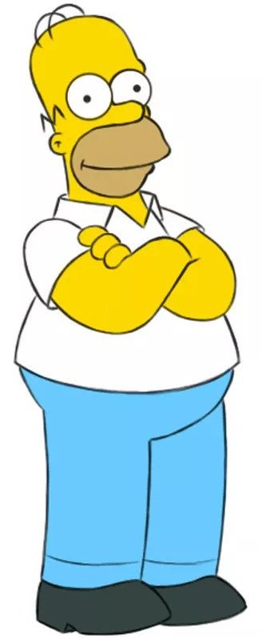
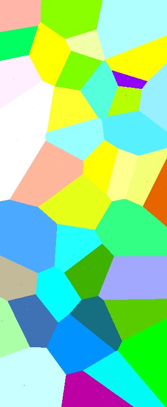
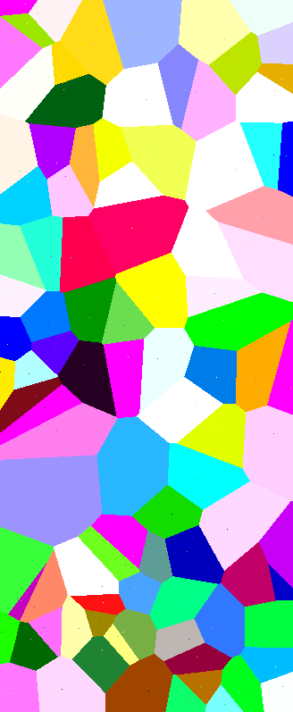
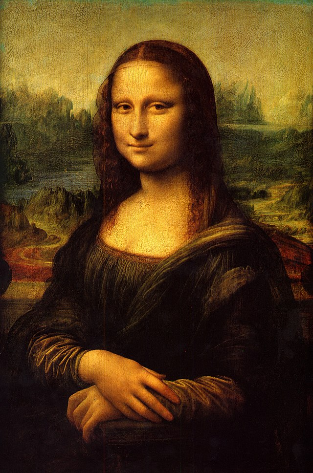
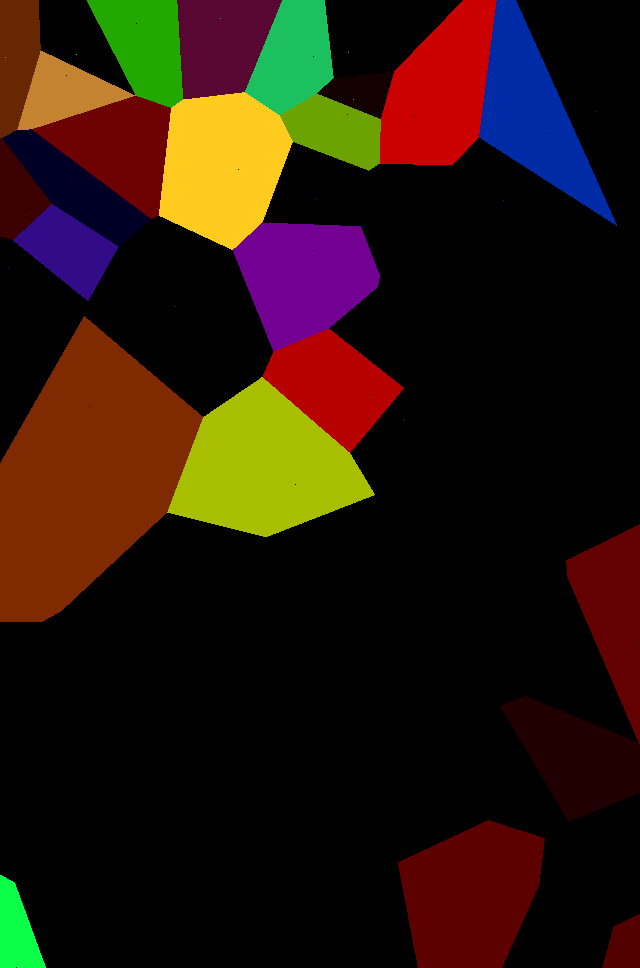

# Voronoi Simulated Annealing
This project uses the [simulated annealing](https://en.wikipedia.org/wiki/Simulated_annealing) algorithm to approximate an input image using [voronoi diagrams](https://en.wikipedia.org/wiki/Voronoi_diagram)

## Overview
This work has been inspired by [this video](https://www.youtube.com/watch?v=aii__13k52M) by [antirez](https://github.com/antirez), where the use of simulated annealing is demoed by approximating an image with triangles (original project [here](https://github.com/antirez/shapeme))

In this project, written in Go, i decided to use Voronoi diagrams instead of triangles.  
The voronoi tessellation logic is based on [this other project of mine](https://github.com/st3penta/voronoi-golang)

These are some of the results obtained by running the simulation:

 

*Homer used as target image, approximated using 40 voronoi cells (second image) and 100 voronoi cells (third image)*

 

*Monnalisa used as target image, approximated using 60 voronoi cells*

## Usage

You can run the script using the default parameters by simply executing the following command:  
`./voronoiannealing run`

More detailed instructions about the parameters used in the simulation can be found with the help command:  
`./voronoiannealing help`

### Hotkeys

`Space`: suspends/resumes the simulation

## Something about the annealing algorithm

The principle of the simulated annealing is pretty simple:
it tries to find an approximated solution of a target problem, starting from a random solution and iteratively refining it. In this case the problem is getting as close as possible to the input image by using a voronoi diagram.

In this project the solution at each iteration is given by the positions and colors of the seeds of the diagram, that are the points from which the voronoi cells are generated.  
At each iteration, a random number of perturbations is performed on the current solution, by altering the color and/or the coordinates of some seeds.  
After generating the perturbated solution, its *temperature* is evaluated by computing the distance between the resulting image and the target image.

The generated solution is accepted if it improves the temperature with respect to the previous iteration, but worse solutions can also be accepted, with a probability inversely proportional to the temperature difference between the two.

**Note**: in this project the concept of *temperature*, derived from the simulated annealing terminology, is used improperly.  
In the standard technique, the temperature is a value that starts high and gets decremented over time, but it is unrelated to the quality of the current iteration. The acceptance criterion accepts worse solutions with a probability proportional to the temperature and inversely proportional to the quality difference with respect to the previous iteration.  
This project, on the contrary, intends the temperature as the quality metric of the solution, meaning that the acceptance probability depends on how close a given solution is to the target, and not on time.

